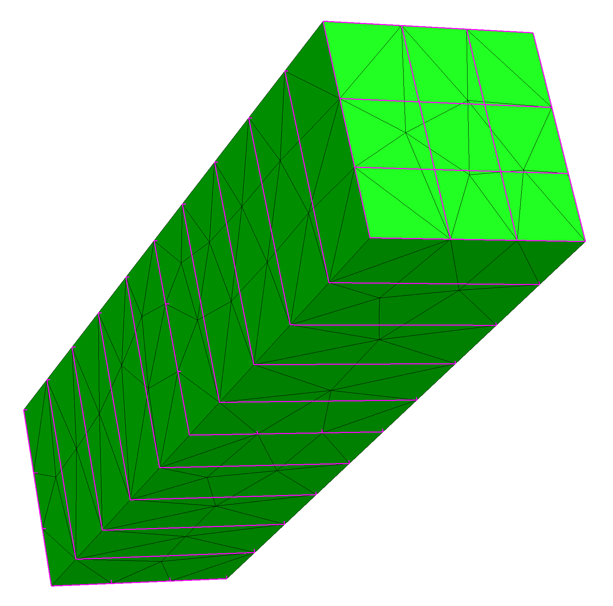

### Periodic mesh

Periodic identifications between surfaces can be made in geometry. Netgen uses it to generate meshes suitable for imposition of periodic boundary conditions. 

- Example: [periodicbox.py](../projects/nanogap/learn2mesh/periodicbox.py). You can ask Netgen to mark (in purple) vertices that are identified to be the same due to periodicity from the menu option `View->Mesh->Show identified points` and you should get a picture like this:

### Periodic finite element space 

Once you have a periodic mesh, the next step in implementing a periodic boundary condition is to implement the periodic finite element space you need. This can be done by **identifying** degrees of freedoms. An example with one pair of surfaces is available with NGSolve's tutorial [MyLittleNGSolve](https://sourceforge.net/p/ngsolve/ml-ngs/ci/master/tree/periodic.cpp). In addition, two xy-periodic spaces are available in `libDPG`: 

- [Periodic H1 space](../spaces/periodich1.cpp)
- [Periodic H(curl) space](../spaces/periodichcurl.cpp)

Usage examples: 

- [magnet.pde](../pde/magnet.pde)
- [periodicmaxwell.py](../python/periodicmaxwell.py)
