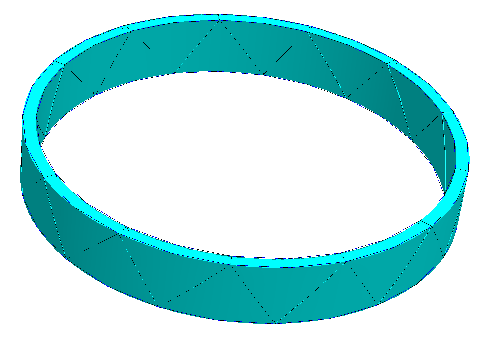
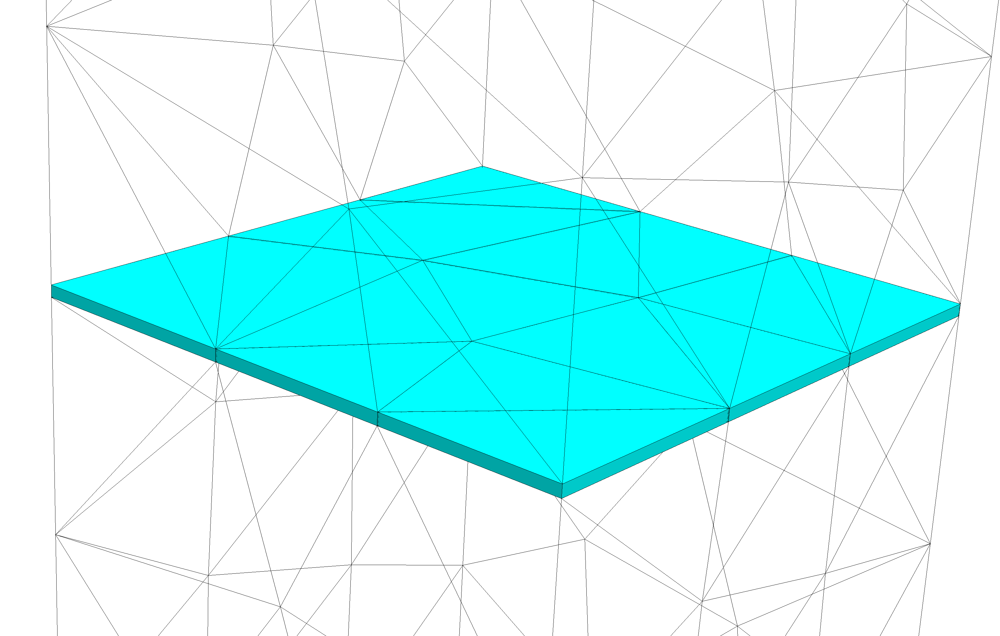
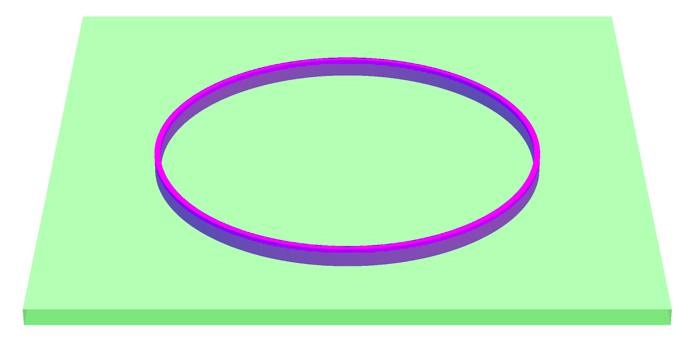
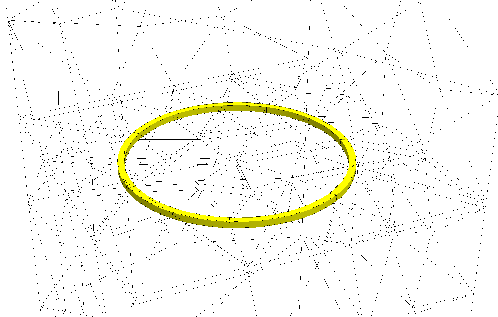

### Meshes with Prismatic elements

Netgen can be alerted to close surfaces which will automatically trigger prismatic element generation. Here are two examples: 

- [thincyl.py](../projects/nanogap/learn2mesh/thincyl.py).
- [thinlayer.py](../projects/nanogap/learn2mesh/thinlayer.py).

The first example  shows how thin annular rings can be meshed by curved prisms.

The second example meshes a flat thin layer using prisms, which can be seen after zooming into the thin layer in the middle of the meshed box.

### Meshes with Hexahedral elements

Sometimes we have a situation where two pairs of close surfaces intersect, such as in this figure:

In such cases, Netgen will attempt hexahedral element generation at the intersection, match it with prisms surrounding it, and transition to tetrahedral mesh using **pyramidal** elements.   Here is an example: 

-  [thinlayercyl.py](../projects/nanogap/learn2mesh/thinlayercyl.py).

The generated mesh, when zoomed in near the middle thin layer shows a ring of hexahderal elements:

